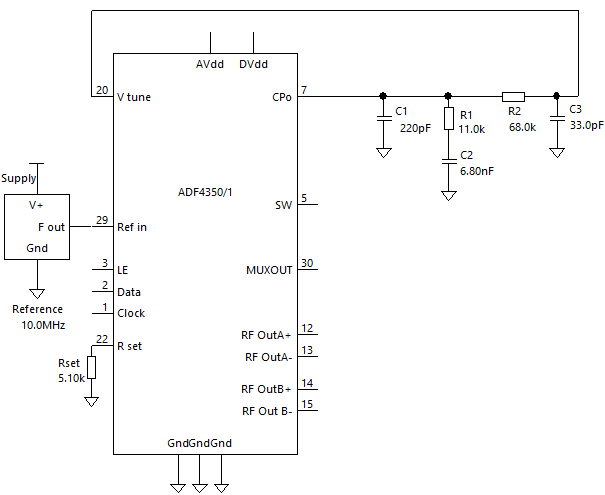
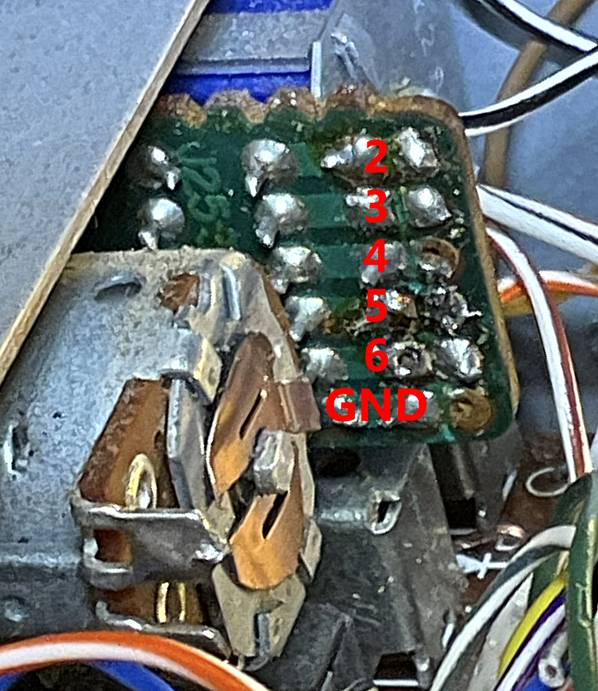
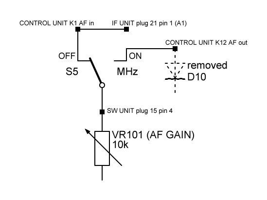
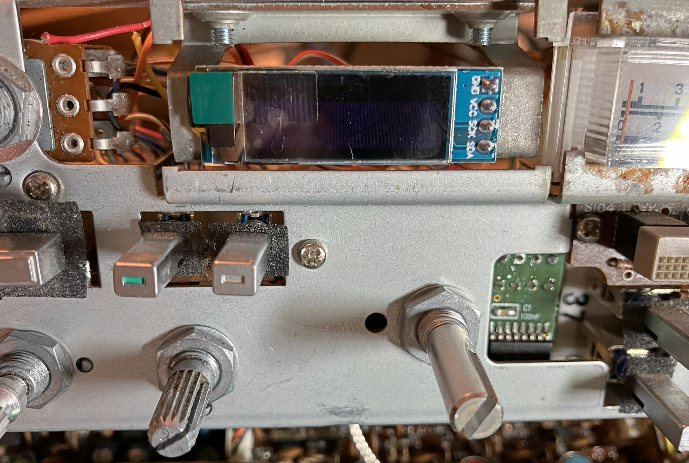

# tr-pll70

## Current status
No major hardware changes are expected. The firmware is running, but is not yet complete.

**This is purely a hobby project. I cannot guarantee that it is error-free or that the modification will be successful.**

## PLL
Cheap boards with the PLL module ADF4351 are available on the market. Unfortunately, it is difficult to generate a clean signal with a 10 Hz step width at 456 MHz. For this reason, the PLL operates with a step of 1 MHz. A Si5351A clock generator on the CONTOL UNIT generates a reference frequency of around 10 MHz, which is changed in very small steps. This creates a 10 Hz raster at the end frequency.

### Proposal for the loop filter
This filter was designed for a PFD of 10 MHz.
 

### ADF4351 boards
Here are a few details about different board variants. Let's call them *Board 1* and *Board 2*. As with everything else in this project, there is no guarantee that the information is correct.

#### Board 1 v1.4

#### Board 1 v.1.5
 

#### Board 2

## Quick guide
The service manual for the radio is helpful when making modifications.
1. Assemble the circuit boards. Only the 7805 voltage regulator will be installed later.
2. Replace the old rotary encoder by the new ENCODER UNIT.
3. Move plug 7 from the CONTOL UNIT to K2 on the ENCODER UNIT and connect the GND pin of the memory switch to the housing. 
4. Wire the switches MR and MS via connector 37 as shown in the diagram of the ENCODER UNIT. Wires 1, 2, 6 (or 5) of connector 37 are not used. 
5. Remove the old CONTROL UNIT. All connections must be unplugged or cut if there is no plug.
6. Install the new CONTROL UNIT and the 7805 regulator in the frame.
7. Connect the base plate of the piezo disk to ground and the large resonance surface to K6 on the circuit board.
8. Replace the diodes D3, D4 and D11 on the SW UNIT with wire jumpers. Also remove D10. This is where the audio signal will be connected in the next step.
9. Wire the RX audio signal according to the plan. 
10. Wire the switches AB and DS as well as the button M via the connectors 13 and 15 as shown in the diagram of the ENCODER UNIT. Some wires of the connectors are not used. 
11. Connect the HOLD and SCAN buttons (used as STEP+ and STEP-) to the ENCODER UNIT.
12. Plug connector 12 into slot K10 of the CONTROL UNIT and connector 9 into slot K11.
13. Route the PTT line via K4 on the CONTOL UNIT and connect the UP and DOWN signals from the microphone.
Note: If you want to use the STBY socket on the rear panel as an input, it must be rewired and connected in parallel to the PTT button. Otherwise, it may only be used as an output.
14. Connect the encoder sockets on the ENCODER UNIT (K3) and on the CONTROL UNIT (K8) to each other.
15. Remove the seven-segment display and stick a display with SSD1306 controller and 128 x 32 pixels onto the holder. 
16. Wire the I²C bus from the CONTROL UNIT to the ENCODER UNIT and from there to the display.
Connect the TX OFFSET switch to K2 on the CONTROL UNIT.
17. Remove the HET UNIT. The white wire 8C (connector 5 pin 8) is useful for the power supply of the PLL. Apart from this one wire, plugs 5 and 6 can be completely removed.
18. Attach the PLL board and the low-pass board in the housing of the HET UNIT. Connect the data lines and the reference input of the PLL to the CONTROL UNIT. The 8C line with 8 volts or the 5-volt line from the CONTROL UNIT serves as the power supply. The LD signal (lock detect) can be taken from the pin LD or MUX OUT.
19. The output signal of the PLL is fed to the LT and RT coax cables via the low-pass filter.
20. Depending on the output power of your PLL board, it is likely that you have to give the resistor R1 (27 Ohm) on the DRIVE UNIT, which converts part of the power into heat, a higher value. In this case you also have to change C1 (470 pF) in order to create an adjustment to 50 Ohm. If you remove R1 completely, C1 should have 10 pF.
    |               | R1     | C1     |
    |---------------|--------|--------|
    | original      | 27 Ohm | 470 pF |
    | recommended   | 47 Ohm | 33 pF  |
    | low PLL power | ∞      | 10 pF  |
